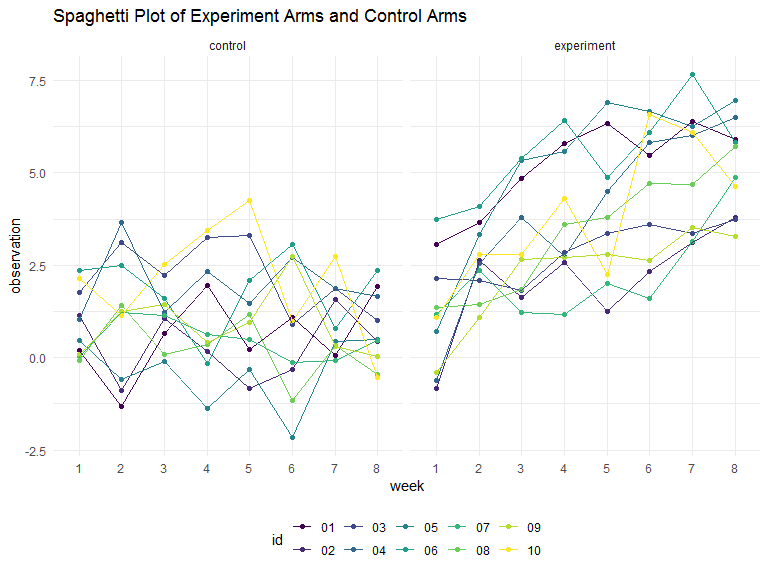
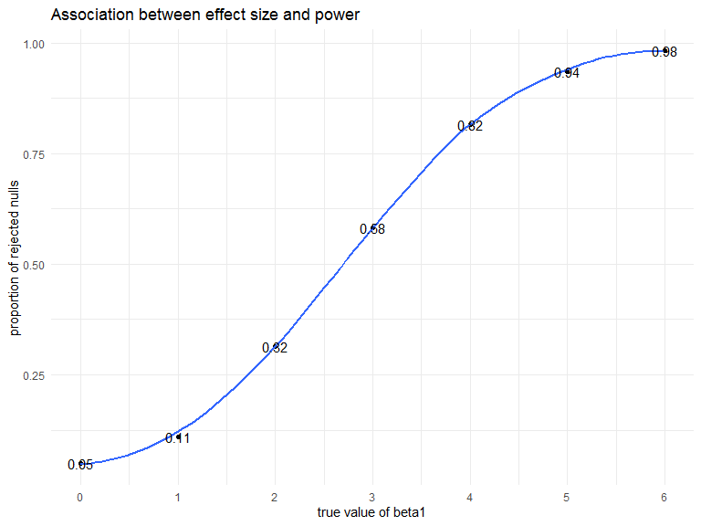
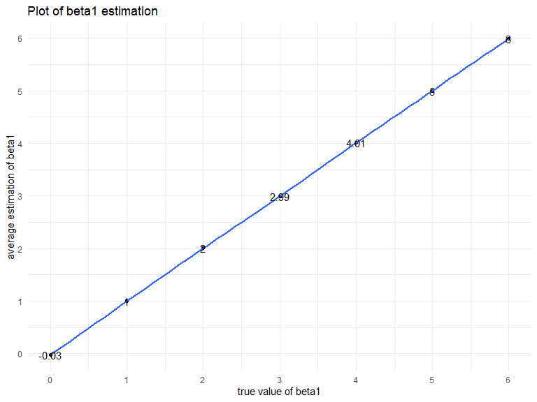
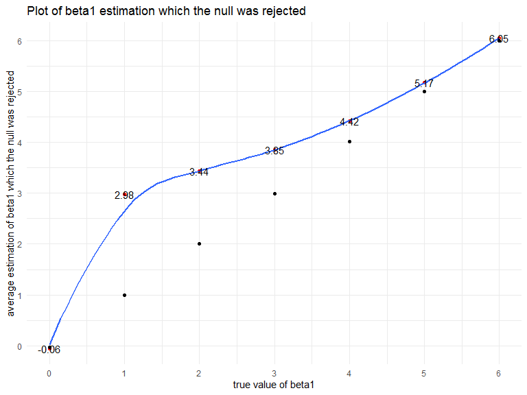

P8105 Homework 3
================
Junhui Mi
2019/11/9

# Problem 1

``` r
set.seed(10)

iris_with_missing = iris %>% 
  map_df(~replace(.x, sample(1:150, 20), NA)) %>%
  mutate(Species = as.character(Species))

replace_missing = function(x) {
    if (is.numeric(x)) {
    x[is.na(x)] = mean(x, na.rm = TRUE)
      }
    x[is.na(x)] = "virginica"
    x
}

iris_without_missing_list = map(iris_with_missing, replace_missing)

iris_without_missing_tibble = map_dfr(iris_with_missing, replace_missing)

iris_without_missing_tibble
```

    ## # A tibble: 150 x 5
    ##    Sepal.Length     Sepal.Width Petal.Length     Petal.Width      Species
    ##    <chr>            <chr>       <chr>            <chr>            <chr>  
    ##  1 5.1              3.5         1.4              0.2              setosa 
    ##  2 4.9              3           1.4              0.2              setosa 
    ##  3 4.7              3.2         1.3              0.2              setosa 
    ##  4 4.6              3.1         1.5              1.19230769230769 setosa 
    ##  5 5                3.6         1.4              0.2              setosa 
    ##  6 5.4              3.9         1.7              0.4              setosa 
    ##  7 5.81923076923077 3.4         1.4              0.3              setosa 
    ##  8 5                3.4         1.5              0.2              setosa 
    ##  9 4.4              2.9         1.4              0.2              setosa 
    ## 10 4.9              3.1         3.76538461538462 0.1              setosa 
    ## # ... with 140 more rows

This function replaces missing values in “iris\_with\_missing”.
“iris\_without\_missing\_list” returns a list of 5, while
“iris\_without\_missing\_tibble” turns the list into a tibble.

# Problem 2

``` r
filename = list.files("./data") %>% as_tibble()

con_exp = list.files("./data", full.names = TRUE)

load_and_tidy = function(path) {
  df = read_csv(path) %>%
    janitor::clean_names() %>%
    mutate(
        arm = str_sub(path, 8, 10),
        id = str_sub(path, 12, 13),
        arm = str_replace_all(arm, c("con" = "control", "exp" = "experiment"))) %>%
    select(id, arm, week_1:week_8)
  df
}

observation_data = map_df(.x = con_exp, ~ load_and_tidy(.x))
```

    ## Parsed with column specification:
    ## cols(
    ##   week_1 = col_double(),
    ##   week_2 = col_double(),
    ##   week_3 = col_double(),
    ##   week_4 = col_double(),
    ##   week_5 = col_double(),
    ##   week_6 = col_double(),
    ##   week_7 = col_double(),
    ##   week_8 = col_double()
    ## )
    ## Parsed with column specification:
    ## cols(
    ##   week_1 = col_double(),
    ##   week_2 = col_double(),
    ##   week_3 = col_double(),
    ##   week_4 = col_double(),
    ##   week_5 = col_double(),
    ##   week_6 = col_double(),
    ##   week_7 = col_double(),
    ##   week_8 = col_double()
    ## )
    ## Parsed with column specification:
    ## cols(
    ##   week_1 = col_double(),
    ##   week_2 = col_double(),
    ##   week_3 = col_double(),
    ##   week_4 = col_double(),
    ##   week_5 = col_double(),
    ##   week_6 = col_double(),
    ##   week_7 = col_double(),
    ##   week_8 = col_double()
    ## )
    ## Parsed with column specification:
    ## cols(
    ##   week_1 = col_double(),
    ##   week_2 = col_double(),
    ##   week_3 = col_double(),
    ##   week_4 = col_double(),
    ##   week_5 = col_double(),
    ##   week_6 = col_double(),
    ##   week_7 = col_double(),
    ##   week_8 = col_double()
    ## )
    ## Parsed with column specification:
    ## cols(
    ##   week_1 = col_double(),
    ##   week_2 = col_double(),
    ##   week_3 = col_double(),
    ##   week_4 = col_double(),
    ##   week_5 = col_double(),
    ##   week_6 = col_double(),
    ##   week_7 = col_double(),
    ##   week_8 = col_double()
    ## )
    ## Parsed with column specification:
    ## cols(
    ##   week_1 = col_double(),
    ##   week_2 = col_double(),
    ##   week_3 = col_double(),
    ##   week_4 = col_double(),
    ##   week_5 = col_double(),
    ##   week_6 = col_double(),
    ##   week_7 = col_double(),
    ##   week_8 = col_double()
    ## )
    ## Parsed with column specification:
    ## cols(
    ##   week_1 = col_double(),
    ##   week_2 = col_double(),
    ##   week_3 = col_double(),
    ##   week_4 = col_double(),
    ##   week_5 = col_double(),
    ##   week_6 = col_double(),
    ##   week_7 = col_double(),
    ##   week_8 = col_double()
    ## )
    ## Parsed with column specification:
    ## cols(
    ##   week_1 = col_double(),
    ##   week_2 = col_double(),
    ##   week_3 = col_double(),
    ##   week_4 = col_double(),
    ##   week_5 = col_double(),
    ##   week_6 = col_double(),
    ##   week_7 = col_double(),
    ##   week_8 = col_double()
    ## )
    ## Parsed with column specification:
    ## cols(
    ##   week_1 = col_double(),
    ##   week_2 = col_double(),
    ##   week_3 = col_double(),
    ##   week_4 = col_double(),
    ##   week_5 = col_double(),
    ##   week_6 = col_double(),
    ##   week_7 = col_double(),
    ##   week_8 = col_double()
    ## )
    ## Parsed with column specification:
    ## cols(
    ##   week_1 = col_double(),
    ##   week_2 = col_double(),
    ##   week_3 = col_double(),
    ##   week_4 = col_double(),
    ##   week_5 = col_double(),
    ##   week_6 = col_double(),
    ##   week_7 = col_double(),
    ##   week_8 = col_double()
    ## )
    ## Parsed with column specification:
    ## cols(
    ##   week_1 = col_double(),
    ##   week_2 = col_double(),
    ##   week_3 = col_double(),
    ##   week_4 = col_double(),
    ##   week_5 = col_double(),
    ##   week_6 = col_double(),
    ##   week_7 = col_double(),
    ##   week_8 = col_double()
    ## )
    ## Parsed with column specification:
    ## cols(
    ##   week_1 = col_double(),
    ##   week_2 = col_double(),
    ##   week_3 = col_double(),
    ##   week_4 = col_double(),
    ##   week_5 = col_double(),
    ##   week_6 = col_double(),
    ##   week_7 = col_double(),
    ##   week_8 = col_double()
    ## )
    ## Parsed with column specification:
    ## cols(
    ##   week_1 = col_double(),
    ##   week_2 = col_double(),
    ##   week_3 = col_double(),
    ##   week_4 = col_double(),
    ##   week_5 = col_double(),
    ##   week_6 = col_double(),
    ##   week_7 = col_double(),
    ##   week_8 = col_double()
    ## )
    ## Parsed with column specification:
    ## cols(
    ##   week_1 = col_double(),
    ##   week_2 = col_double(),
    ##   week_3 = col_double(),
    ##   week_4 = col_double(),
    ##   week_5 = col_double(),
    ##   week_6 = col_double(),
    ##   week_7 = col_double(),
    ##   week_8 = col_double()
    ## )
    ## Parsed with column specification:
    ## cols(
    ##   week_1 = col_double(),
    ##   week_2 = col_double(),
    ##   week_3 = col_double(),
    ##   week_4 = col_double(),
    ##   week_5 = col_double(),
    ##   week_6 = col_double(),
    ##   week_7 = col_double(),
    ##   week_8 = col_double()
    ## )
    ## Parsed with column specification:
    ## cols(
    ##   week_1 = col_double(),
    ##   week_2 = col_double(),
    ##   week_3 = col_double(),
    ##   week_4 = col_double(),
    ##   week_5 = col_double(),
    ##   week_6 = col_double(),
    ##   week_7 = col_double(),
    ##   week_8 = col_double()
    ## )
    ## Parsed with column specification:
    ## cols(
    ##   week_1 = col_double(),
    ##   week_2 = col_double(),
    ##   week_3 = col_double(),
    ##   week_4 = col_double(),
    ##   week_5 = col_double(),
    ##   week_6 = col_double(),
    ##   week_7 = col_double(),
    ##   week_8 = col_double()
    ## )
    ## Parsed with column specification:
    ## cols(
    ##   week_1 = col_double(),
    ##   week_2 = col_double(),
    ##   week_3 = col_double(),
    ##   week_4 = col_double(),
    ##   week_5 = col_double(),
    ##   week_6 = col_double(),
    ##   week_7 = col_double(),
    ##   week_8 = col_double()
    ## )
    ## Parsed with column specification:
    ## cols(
    ##   week_1 = col_double(),
    ##   week_2 = col_double(),
    ##   week_3 = col_double(),
    ##   week_4 = col_double(),
    ##   week_5 = col_double(),
    ##   week_6 = col_double(),
    ##   week_7 = col_double(),
    ##   week_8 = col_double()
    ## )
    ## Parsed with column specification:
    ## cols(
    ##   week_1 = col_double(),
    ##   week_2 = col_double(),
    ##   week_3 = col_double(),
    ##   week_4 = col_double(),
    ##   week_5 = col_double(),
    ##   week_6 = col_double(),
    ##   week_7 = col_double(),
    ##   week_8 = col_double()
    ## )

``` r
observation_data
```

    ## # A tibble: 20 x 10
    ##    id    arm        week_1 week_2 week_3 week_4 week_5 week_6 week_7 week_8
    ##    <chr> <chr>       <dbl>  <dbl>  <dbl>  <dbl>  <dbl>  <dbl>  <dbl>  <dbl>
    ##  1 01    control      0.2  -1.31    0.66   1.96   0.23   1.09   0.05   1.94
    ##  2 02    control      1.13 -0.88    1.07   0.17  -0.83  -0.31   1.58   0.44
    ##  3 03    control      1.77  3.11    2.22   3.26   3.31   0.89   1.88   1.01
    ##  4 04    control      1.04  3.66    1.22   2.33   1.47   2.7    1.87   1.66
    ##  5 05    control      0.47 -0.580  -0.09  -1.37  -0.32  -2.17   0.45   0.48
    ##  6 06    control      2.37  2.5     1.59  -0.16   2.08   3.07   0.78   2.35
    ##  7 07    control      0.03  1.21    1.13   0.64   0.49  -0.12  -0.07   0.46
    ##  8 08    control     -0.08  1.42    0.09   0.36   1.18  -1.16   0.33  -0.44
    ##  9 09    control      0.08  1.24    1.44   0.41   0.95   2.75   0.3    0.03
    ## 10 10    control      2.14  1.15    2.52   3.44   4.26   0.97   2.73  -0.53
    ## 11 01    experiment   3.05  3.67    4.84   5.8    6.33   5.46   6.38   5.91
    ## 12 02    experiment  -0.84  2.63    1.64   2.58   1.24   2.32   3.11   3.78
    ## 13 03    experiment   2.15  2.08    1.82   2.84   3.36   3.61   3.37   3.74
    ## 14 04    experiment  -0.62  2.54    3.78   2.73   4.49   5.82   6      6.49
    ## 15 05    experiment   0.7   3.33    5.34   5.57   6.9    6.66   6.24   6.95
    ## 16 06    experiment   3.73  4.08    5.4    6.41   4.87   6.09   7.66   5.83
    ## 17 07    experiment   1.18  2.35    1.23   1.17   2.02   1.61   3.13   4.88
    ## 18 08    experiment   1.37  1.43    1.84   3.6    3.8    4.72   4.68   5.7 
    ## 19 09    experiment  -0.4   1.08    2.66   2.7    2.8    2.64   3.51   3.27
    ## 20 10    experiment   1.09  2.8     2.8    4.3    2.25   6.57   6.09   4.64

``` r
observation_data %>%
  gather(key = week, value = observation, week_1:week_8) %>%
  mutate(week = str_replace(week, "week_", "")) %>%
  ggplot(aes(x = week, y = observation, color = id, group = id)) +
  geom_point() + geom_line() + facet_grid(~arm) + 
  labs(title = "Spaghetti Plot of Experiment Arms and Control Arms")
```



Comment:

From the plot above we can see that data in control group does not
change over time, but experimental group data increases significantly
over time.

# Problem 3

Generate datasets

``` r
set.seed(1)

sim_regression = function(n = 30, beta0 = 2, beta1) {
  
  sim_data = tibble(
    x = rnorm(n, mean = 0, sd = 1),
    y = beta0 + beta1 * x + rnorm(30, 0, sqrt(50))
  )
  
  ls = lm(y ~ x, data = sim_data)
  
  tibble(
    beta1_hat = coef(ls)[2],
    p_value = pull(broom::tidy(ls),p.value)[[2]]
  )
}

output = 
  tibble(beta1_value = c(0:6)) %>% 
  mutate(
    output_list = map(.x = beta1_value,
                      ~rerun(10000, sim_regression(beta1 = .x))),
    estimate_df = map(output_list, bind_rows)) %>% 
  select(-output_list) %>% 
  unnest(estimate_df)
```

``` r
output %>% 
  filter(p_value < 0.05) %>%
  group_by(beta1_value) %>%
  summarize(proportion = n()/10000) %>%
  ggplot(aes(x = beta1_value, y = proportion)) + 
    geom_point() + geom_smooth(se = FALSE) +
  scale_x_continuous(breaks = c(0,1,2,3,4,5,6)) +
  geom_text(aes(label = round(proportion, digits = 2))) +
  labs(title = "Association between effect size and power", 
       x = "true value of beta1",
       y = "proportion of rejected nulls")
```

    ## `geom_smooth()` using method = 'loess' and formula 'y ~ x'



Comment:

From the plot we can see that as beta1 true value increases, the
proportion of rejecting the nulls increases. Effect size is equal to
(beta1 - 0)/sd. This means that as effect size increases, power of the
test increases.

``` r
beta1_estimate = output %>%
  group_by(beta1_value) %>%
  summarize(average_beta1_hat = mean(beta1_hat))

ggplot(data = beta1_estimate,
       aes(x = beta1_value, y = average_beta1_hat)) + 
    geom_point() + geom_smooth(se = FALSE) +
  scale_x_continuous(breaks = c(0,1,2,3,4,5,6)) +
  scale_y_continuous(breaks = c(0,1,2,3,4,5,6)) +
  geom_text(aes(label = round(average_beta1_hat, digits = 2))) +
  labs(title = "Plot of beta1 estimation", 
       x = "true value of beta1",
       y = "average estimation of beta1")
```

    ## `geom_smooth()` using method = 'loess' and formula 'y ~ x'



``` r
output %>%
  filter(p_value < 0.05) %>%
  group_by(beta1_value) %>%
  summarize(average_beta1_hat_rejected = mean(beta1_hat)) %>%
  ggplot(aes(x = beta1_value,
             y = average_beta1_hat_rejected)) + 
    geom_point(color = 2) + geom_smooth(se = FALSE) +
  geom_point(data = beta1_estimate,
             y = pull(beta1_estimate, average_beta1_hat),
             color = "black") +
  scale_x_continuous(breaks = c(0,1,2,3,4,5,6)) +
  scale_y_continuous(breaks = c(0,1,2,3,4,5,6)) +
  geom_text(aes(label = round(average_beta1_hat_rejected, digits = 2))) +
  labs(title = "Plot of beta1 estimation which the null was rejected", 
       x = "true value of beta1",
       y = "average estimation of beta1 which the null was rejected")
```

    ## `geom_smooth()` using method = 'loess' and formula 'y ~ x'



Comment:

The first plot shows the association between the average estimate of
beta1 and the true value of beta1, while the second plot shows the
association between average estimate of beta1 only in samples for which
the null was rejected and true value of beta1.

According to the first plot, the average of estimated beta1 for all
sample is close to the true value of beta1 whatever beta1 is.

According to the second plot, the average estimate of beta1 only in
samples for which the null was rejected is farer from true beta1 if
beta1 is small(0,1,2) and closer to true beta1 if beta1 becomes
larger(4,5,6).

The reason is that when effect size is small, the proportion of
rejection is small, so the average estimate of beta1 only in samples for
which the null was rejected will be far from the true value. When the
effect size is large, then the proportion of rejection is large, so the
average estimate of beta1 only in samples for which the null was
rejected will become closer to the true value.
